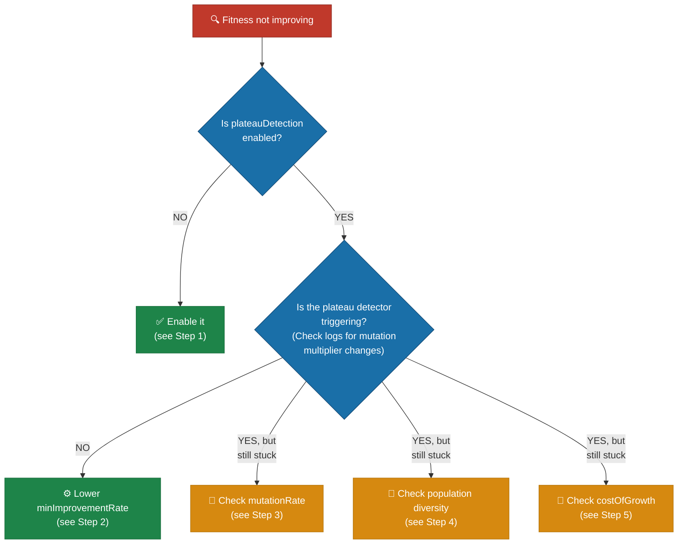
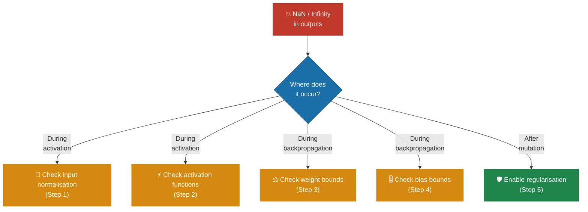

# 📉 Training Troubleshooting

This document covers training-quality symptoms: fitness plateaus, NaN / infinity
outputs, hyperparameter evolution drift, and data fuzzing / regularisation
tuning. See the index in [`../TROUBLESHOOTING.md`](../TROUBLESHOOTING.md) for
other categories.

## Table of contents

- [Fitness plateau](#-fitness-plateau)
- [Creatures producing NaN or Infinity](#-creatures-producing-nan-or-infinity)
- [Data fuzzing and regularisation](#-data-fuzzing-and-regularisation)
- [Hyperparameter evolution](#-hyperparameter-evolution)

## 📉 Fitness plateau

**Symptom:** Fitness stops improving — the best creature's error remains flat
across generations.



**Step 1 — Enable plateau detection:**

```typescript
const config = createNeatConfig({
  plateauDetection: {
    enabled: true,
    windowSize: 10, // Generations to consider
    minImprovementRate: 0.001, // Below this = plateau
    responseMutationMultiplier: 2.0, // Boost mutation on plateau
  },
});
```

The `PlateauDetector` tracks fitness over a sliding window and increases the
mutation rate when improvement stalls, helping the population escape local
optima.

**Step 2 — Adjust plateau sensitivity:**

If the detector is not triggering despite flat fitness, lower
`minImprovementRate`:

```typescript
plateauDetection: {
  enabled: true,
  minImprovementRate: 0.0001, // More sensitive (default: 0.001)
  windowSize: 15,              // Wider window to detect slow drifts
}
```

**Step 3 — Check mutation rate:**

A `mutationRate` that is too low prevents exploration. A rate that is too high
disrupts good solutions.

- **Too low** (< 0.1): Increase to `0.3` (default) or higher
- **Too high** (> 0.7): Reduce to `0.3`–`0.5`
- Consider enabling `stabilityAdaptation` to auto-tune per creature:

```typescript
stabilityAdaptation: {
  enabled: true,
  brittlenessThreshold: 0.3,
  brittleReductionFactor: 0.5,
  stableBoostFactor: 1.3,
}
```

**Step 4 — Check population diversity:**

Low diversity means the population has converged prematurely.

- **Increase `populationSize`**: Larger populations maintain more diversity (try
  `100`–`200` for production runs)
- **Enable ensemble diversity scoring:**

```typescript
ensembleDiversity: {
  enabled: true,
  diversityWeight: 0.15,
  protectDiverseLowPerformers: true,
}
```

- **Lower `geneticCompatibilityThreshold`** (default: `0.3`) to create more
  species and preserve niche exploration

**Step 5 — Check `costOfGrowth`:**

If `costOfGrowth` is too high, evolution avoids adding neurons and synapses,
limiting the network's capacity. Try reducing it:

```typescript
costOfGrowth: 0.00000001, // Lower than default 0.0000001
```

Set to `0` to remove the growth penalty entirely and let fitness alone drive
structural decisions.

> [!TIP]
> If you have already lowered `costOfGrowth` and enabled plateau detection but
> fitness is still flat, try combining both a lower
> `geneticCompatibilityThreshold` and a higher `populationSize` — premature
> convergence is the most common cause of stubborn plateaus.

## 💥 Creatures producing NaN or Infinity

**Symptom:** Creature activations return `NaN` or `Infinity` values, or training
produces `NaN` errors.



**Step 1 — Check input normalisation:**

Extreme input values can cause numerical overflow in activation functions.
Ensure your inputs are normalised to a reasonable range (typically `[-1, 1]` or
`[0, 1]`).

Common mistakes:

- Raw pixel values (0–255) instead of normalised (0–1)
- Unscaled financial data (prices in thousands)
- Missing values represented as large numbers

**Step 2 — Check activation functions:**

Some activation functions are more susceptible to numerical issues:

- **`Exponential`**: Can produce `Infinity` for large positive inputs
- **`TAN`**: Unbounded; can produce very large values near asymptotes
- **`SQRT`**: Returns `NaN` for negative inputs (though NEAT-AI guards this)
- **`Cube`**: x³ grows rapidly for large inputs

Safer alternatives for hidden neurons include `LOGISTIC`, `TANH`, `ReLU`,
`LeakyReLU`, `Mish`, or `Swish`. These are bounded or grow linearly.

NEAT-AI's `ActivationRange` clamps outputs to prevent `Infinity` propagation,
but persistent `NaN` values indicate the root cause needs fixing.

**Step 3 — Check weight bounds:**

Weight regularisation is enabled by default and prevents extreme weight values:

```typescript
weightRegularisation: {
  enabled: true,             // Default: true
  maxAbsoluteWeight: 100,    // Maximum absolute weight (default: 100)
  maxWeightChange: 10,       // Maximum change per mutation (default: 10)
  preferSmallChanges: true,  // Bias towards smaller changes (default: true)
}
```

If you have disabled weight regularisation, re-enable it. If `NaN` persists with
regularisation enabled, lower the bounds:

```typescript
weightRegularisation: {
  maxAbsoluteWeight: 50,  // Tighter bound
  maxWeightChange: 5,     // Smaller mutations
}
```

**Step 4 — Check bias bounds:**

Bias regularisation mirrors weight regularisation:

```typescript
biasRegularisation: {
  enabled: true,           // Default: true
  maxAbsoluteBias: 100,    // Maximum absolute bias (default: 100)
  maxBiasChange: 10,       // Maximum change per mutation (default: 10)
  preferSmallChanges: true,
}
```

Lower `maxAbsoluteBias` and `maxBiasChange` if biases are causing exploding
activations:

```typescript
biasRegularisation: {
  maxAbsoluteBias: 50,
  maxBiasChange: 5,
}
```

**Step 5 — Enable regularisation and stability adaptation:**

If `NaN`/`Infinity` occurs after mutations, the stability adaptation system can
detect and reduce mutations for brittle creatures:

```typescript
stabilityAdaptation: {
  enabled: true,
  brittlenessThreshold: 0.3,      // Fraction of bad outcomes to trigger
  brittleReductionFactor: 0.5,    // Halve mutation rate for brittle creatures
  topologyMutationReductionForBrittle: 0.3, // Reduce structural mutations
}
```

Combined with weight and bias regularisation (both enabled by default), this
prevents the feedback loop where extreme values produce `NaN`, which then
corrupts further calculations.

> [!WARNING]
> If `NaN` values persist despite enabling all regularisation options, check
> whether your fitness function itself can produce `NaN` or `Infinity`. A
> fitness function that divides by zero or takes the logarithm of a non-positive
> number will corrupt the entire population silently.

## 🎲 Data fuzzing and regularisation

### Noise injection does not seem to help

- **Check noise scale:** If `inputNoiseScale` is too small (e.g. `0.001`), the
  perturbations may not be meaningful enough to regularise. Try increasing to
  `0.02`–`0.05`.
- **Check noise scale is not too large:** If `inputNoiseScale` is above `0.1`,
  you may be injecting so much noise that the signal is overwhelmed. Start small
  and increase gradually.
- **Consider combining with cross-validation:** Noise injection works best when
  paired with `crossValidation` to get a more reliable estimate of
  generalisation performance.

### Training converges more slowly with fuzzing enabled

This is expected — noise injection deliberately makes the training task harder
to prevent memorisation. If convergence is unacceptably slow, reduce
`inputNoiseScale` or increase `iterations`/`timeoutMinutes`.

### Cross-validation increases training time significantly

Each generation evaluates creatures `k` times (once per fold). If training time
is a concern, reduce `folds` from the default of 5 to 3, or increase
`timeoutMinutes` to allow more time for the additional evaluations.

## 🧬 Hyperparameter evolution

### Evolved hyperparameters cluster around extreme values

- **Check bounds:** If `minLearningRate` and `maxLearningRate` are too far
  apart, evolution may oscillate between extremes. Narrow the range.
- **Reduce mutation magnitude:** Lower `mutationStdDev` from `0.1` to `0.05` for
  more gradual adaptation.
- **Increase population size:** Hyperparameter evolution benefits from larger
  populations to maintain diversity in the hyperparameter gene pool.

## See also

- [Configuration troubleshooting](CONFIGURATION.md) for invalid option
  combinations and `ValidationError` decoding.
- [WASM troubleshooting](WASM.md) — `RuntimeError: unreachable` and panic
  recovery details when NaN cascades into a panic.
- [Configuration guide](../CONFIGURATION_GUIDE.md) for the full configuration
  surface.
