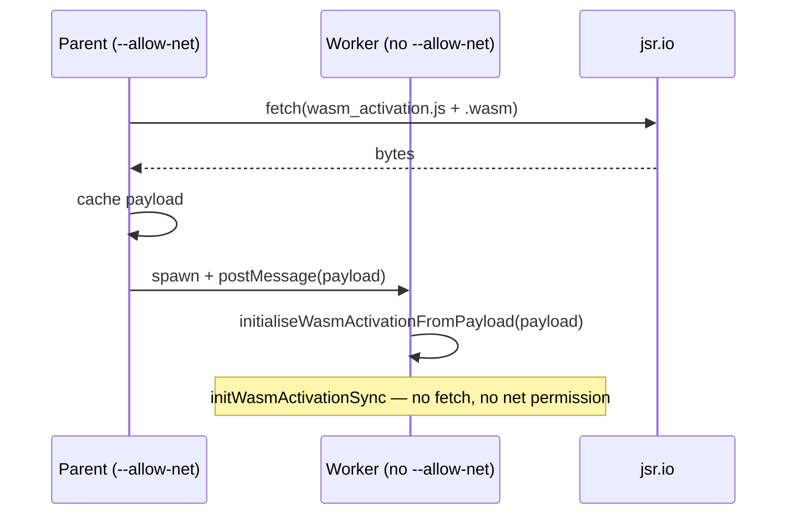

# ⚙️ WASM Troubleshooting

WASM (WebAssembly) activation is **mandatory** in NEAT-AI. There is no
JavaScript fallback. The library initialises the WASM backend automatically;
callers do not need to call any init function or set environment variables.

This document covers WASM init/load failures, JSR-hosted (JavaScript Registry)
worker pre-fetch, runtime panics, and recovery behaviour. See the index in
[`../TROUBLESHOOTING.md`](../TROUBLESHOOTING.md) for other categories.

## Table of contents

- [WASM module not found or failed to compile](#-wasm-module-not-found-or-failed-to-compile)
- [WASM module not initialised](#-wasm-module-not-initialised)
- [WASM in Deno Workers vs Main Thread](#-wasm-in-deno-workers-vs-main-thread)
- [JSR-hosted NEAT-AI in your own workers (Issue #2545)](#-jsr-hosted-neat-ai-in-your-own-workers-issue-2545)
- [RuntimeError: unreachable](#-runtimeerror-unreachable)
- [WASM panic recovery](#-wasm-panic-recovery)

## ⚠️ WASM module not found or failed to compile

**Symptoms:**

- `WASM activation: pkg not found at the canonical package location.`
- `WASM activation could not be loaded. Ensure the NEAT-AI package is installed
  correctly. WASM activation is required.`

**Causes:**

1. The `wasm_activation/pkg/` directory is missing or incomplete.
2. Network connectivity issues when loading from JSR (for `https://` URLs).
3. Insufficient Deno permissions.

**Solutions:**

- Verify the NEAT-AI package includes `wasm_activation/pkg/` with at least:
  - `wasm_activation.js`
  - `wasm_activation_bg.wasm`
- Ensure Deno has `--allow-read` (for local files) and `--allow-net` (for JSR).
- If the vendored bundle is missing or stale, re-sync it by running the
  repo-root `./build.sh`. This does **not** build WASM from source — it syncs
  the pre-built, vendored WASM bundle (`wasm_activation/pkg`) from the pinned
  NEAT-AI-core release into your checkout:
  ```bash
  ./build.sh
  ```

## ⚠️ WASM module not initialised

**Symptoms:**

- `WASM module not initialised`

**Causes:**

- Calling activation methods before the WASM module has finished loading. This
  can happen in custom worker setups that bypass the standard initialisation.

**Solutions:**

- Use the standard `Creature.activate()` API which handles initialisation
  transparently.
- In custom worker setups, ensure `initWasmActivationSync()` is called with the
  correct JS bindings and WASM binary payload before activating creatures.

## 🧵 WASM in Deno Workers vs Main Thread

**Main thread:** WASM auto-initialises at module evaluation time. No action
required.

**NEAT-AI worker system:** The parent thread pre-loads the WASM payload and
sends it to workers during initialisation. Workers call
`initWasmActivationSync()` with the received payload.

**Independent Deno Workers:** If your Deno Worker imports NEAT-AI directly,
auto-initialisation runs at module load. Ensure the worker has `--allow-read`
and/or `--allow-net` permissions.

**Common worker issues:**

- `Worker WASM activation payload missing` — The parent thread did not send the
  WASM payload. Call `fetchWasmForWorkers()` before spawning workers.
- `Worker WASM activation init failed` — Synchronous init returned false. Check
  for re-entrancy issues or payload corruption.
- `Worker init timed out after Ns` — Increase the timeout by setting
  `NEAT_AI_WORKER_INIT_TIMEOUT_MS` (default: 60,000 ms, minimum: 1,000 ms).

### 🔎 Init-phase timing diagnostics (Issue #3494)

Every worker init emits one compact, always-on `info` line so a rare init stall
is diagnosable from the log alone (no debug flag to enable after the fact). The
shape is a **contract** — GRQ health tooling matches on the fixed
`[WasmWorkerInit]` prefix and field keys, so treat them as stable:

```text
[WasmWorkerInit] worker=worker-3 outcome=ok handshakeMs=42 cache=hit \
  cacheDir=/home/u/.cache/neat-ai/wasm bundleBytes=1234567 bundleLoadMs=3 \
  glueImportMs=12 instantiateMs=27 wasmTotalMs=42 workerError=none
```

- `cache` is `hit` / `miss` / `disabled` / `local` / `unknown`. `disabled` means
  no cache directory could be resolved, so **every** start fetches over the
  network — set `NEAT_AI_WASM_CACHE_DIR` (or `XDG_CACHE_HOME` / `HOME`) to
  restore caching.
- The WASM phase timings (`bundleLoadMs`, `glueImportMs`, `instantiateMs`) are
  measured on the parent/main thread by `initWasmActivation`.

On a handshake timeout the same breakdown is embedded in the thrown error
message (after the trailing `Error:` token of the fallback log line). Because
the worker never answered, the **child's** internal phases are unknowable, so
the message reports only what the parent can see and says so explicitly rather
than printing zeros:

```text
[WasmWorkerInit] Worker init: no response after 60s (worker=worker-3). \
  Parent-observed: handshakeMs=60001 workerError=none wasm[cache=hit …]. \
  Child WASM phase timings unknown — the worker never answered the init \
  handshake (may be stuck loading WASM, CPU-starved, or OOM).
```

The self-healing direct-execution fallback is unchanged — the timeout still
fires and the worker slot still degrades gracefully; it is now just loud about
_what_ it was waiting on. The contract is defined in
`src/wasm/WasmInitDiagnostics.ts`.

## 🌐 JSR-hosted NEAT-AI in your own workers (Issue #2545)

**Symptoms:**

- Parent process is run with `--allow-net`, yet a Deno Worker spawned by your
  application logs:

  ```
  Failed to initialise WASM activation module:
    NotCapable: Requires net access to "jsr.io:443",
    run again with the --allow-net flag
      at Module.__wbg_init (https://jsr.io/.../wasm_activation.js:...)
      at initWasmActivation (https://jsr.io/.../WasmModuleLoader.ts:...)
      at WasmAutoInit.ts:...
  ```

- The library silently degrades onto the slow path (or, since Issue #1263, fails
  fast — prior to that release the Rust panic surfaced as
  `RuntimeError: unreachable`).

**Cause.** When NEAT-AI is consumed from JSR (`https://jsr.io/...`),
`WasmModuleLoader.ts` resolves the WASM payload to an `https:` URL and calls the
wasm-bindgen `fetch(URL)` path. That path needs `net` permission on `jsr.io:443`
_inside the worker scope_. Two ways the permission can be missing even when the
parent has `--allow-net`:

1. **Older Deno** (pre-2.5). `Worker.deno.permissions` defaulted to `none` for
   spawned workers. Parent permissions did not flow into the worker. This is the
   most common cause for the production stack traces seen in Issue #2543.
2. **Explicit narrowing.** Application code passes
   `new Worker(url, { deno: { permissions: { net: ["api.example.com"] } } })` to
   lock the worker down to a specific host. `jsr.io` is not on the list, so the
   wasm-bindgen `fetch(URL)` is denied.

**Recommended fix — pre-fetch the payload in the parent and forward it.**

The library exposes a stable, in-process payload-passing API that bypasses
network access in the worker entirely. Have the parent fetch once, then send the
bytes over `postMessage` or a shared module:

```typescript
import {
  fetchWasmForWorkers,
  initialiseWasmActivationFromPayload,
  loadWasmActivationInitPayloadAsync,
} from "@stsoftware/neat-ai";

// --- In the parent (has --allow-net) ---
await fetchWasmForWorkers(); // Populates the in-memory cache.
const payload = await loadWasmActivationInitPayloadAsync();
const worker = new Worker(new URL("./worker.ts", import.meta.url).href, {
  type: "module",
});
worker.postMessage({ kind: "wasm-init", payload });

// --- In the worker (no --allow-net required) ---
self.onmessage = async (ev) => {
  if (ev.data?.kind === "wasm-init") {
    await initialiseWasmActivationFromPayload(ev.data.payload, false);
    // ... continue with creature work
  }
};
```

Because `initialiseWasmActivationFromPayload()` calls `initWasmActivationSync`
with the bytes, the worker never reaches the `fetch(URL)` path and therefore
never needs `net` permission. This works under both old and new Deno, and under
narrowed worker permission lists.

**Alternative — upgrade Deno and rely on default inheritance.** From Deno 2.5
onwards, workers spawned with no explicit `deno.permissions` inherit the
parent's permissions, so a parent with `--allow-net` is sufficient on its own.
This is the simplest fix when you control the host's Deno version.

**Sequence of events:**



**Why not just pass `deno: { permissions: "inherit" }` automatically?**

In stable Deno 2.x, `Worker.deno.permissions` is gated by
`--unstable-worker-options`. Setting `permissions: "inherit"` unconditionally
inside the library makes worker spawn fail for every consumer that has not opted
into that flag. Once that gate is removed, the library can adopt explicit
inheritance internally; until then, the pre-fetch helpers above are the
supported workaround.

## 💥 RuntimeError: unreachable

**Symptoms:**

- `RuntimeError: unreachable` during activation in long-running workloads.

**Cause:** WASM heap exhaustion from too many cached `CompiledNetwork` instances
(Issue #1338).

**Solutions:**

- The LRU (Least Recently Used) cache automatically evicts old entries. A
  configured `Neat` run sizes it from your population, so the **effective
  default is `populationSize * 2`** cached instances; the bare `512` is only the
  low-level module fallback used when the LRU is driven directly without a
  `Neat` config. Reduce the limit if memory is tight:
  ```typescript
  import { setMaxCachedWasmCreatureActivations } from "@stsoftware/neat-ai";
  setMaxCachedWasmCreatureActivations(256);
  ```
  The package exposes a single entry point, `@stsoftware/neat-ai`; every public
  symbol is re-exported from it, so there are no subpath specifiers.
- Reduce parallel creature count or population size.

## 🧪 Producer-gate WASM compile rejects (Issue #2672)

**Symptoms:**

- Log lines that begin with
  `[Offspring] dropping offspring that fails WASM
  compile` or
  `[Mutator] reverting mutation that fails WASM compile`.
- New files appearing under `.diagnostics/` with the prefixes
  `offspring-wasm-compile-trap-<uuid>-*` or
  `mutator-wasm-compile-trap-<operator>-<uuid>-*`.

**Cause:** the producer-gate
([`ensureProducerOutputCompiles`](../../src/wasm/ProducerCompileGuard.ts))
attempted to build a `CompiledNetwork` from a freshly bred or mutated creature
and the WASM constructor trapped (typically `RuntimeError: unreachable`). Rather
than letting the bad topology contaminate training, the producers drop the
offspring (`Offspring.breed`) or revert the mutation
(`Mutator.repairAfterMutation`) and write a diagnostic dump.

**Where the dumps land:**

- `.diagnostics/offspring-wasm-compile-trap-<childUuid>-*` — written by
  `src/architecture/Offspring.ts` when the gate rejects an offspring after
  breeding.
- `.diagnostics/mutator-wasm-compile-trap-<mutationOperator>-<creatureUuid>-*` —
  written by `src/NEAT/Mutator.ts` when the gate rejects a mutated creature.

Each dump consists of several files sharing the same timestamp suffix:

- `*-error-*.txt` — the typed error message with stack trace.
- `*-mother-*.json` / `*-father-*.json` — parent exports (offspring path only).
- `*-offspring-*.json` / `*-creature-*.json` — the post-fix creature export.
- `*-context-*.json` — the replay metadata described below.

**Replay metadata** (`*-context-*.json`):

| Field                                | Path      | Meaning                                                |
| ------------------------------------ | --------- | ------------------------------------------------------ |
| `motherUuid` / `fatherUuid`          | offspring | parent stable identifiers                              |
| `offspringUuid`                      | offspring | child stable identifier                                |
| `breedSeed`                          | offspring | active PRNG seed at the time of the breed, or `"n/a"`  |
| `mutationName`                       | mutator   | the operator that was just applied (e.g. `ADD_NODE`)   |
| `creatureUuid`                       | mutator   | creature stable identifier                             |
| `prngSeed`                           | mutator   | active PRNG seed, or `"n/a"` when the RNG was unseeded |
| `prngSeeded`                         | both      | whether the active RNG was deterministic               |
| `trapMessage`                        | both      | the `WasmBinaryValidator` trap message                 |
| `preFixOffspring` / `preFixCreature` | both      | post-splice/post-mutation export _before_ `fix()` ran  |
| `preMutationCreature`                | mutator   | shallow clone of the creature _before_ `mutate()` ran  |
| `neuronCount` etc.                   | both      | shape summary at the time of rejection                 |

**Replaying offline:**

1. Pull the four files out of `.diagnostics/` for a single timestamp.
2. Re-seed the RNG (`createSeededRng(breedSeed)` / `createSeededRng(prngSeed)`)
   so any RNG-dependent repair step replays.
3. For offspring: load the parent JSONs with `Creature.fromJSON` and call
   `Offspring.breed(mother, father, …)`; the same combination of seed + parents
   reproduces the failure.
4. For mutator: load `preMutationCreature` with `Creature.fromJSON`, call
   `mutator.mutateCreature(creature, Mutation[mutationName])`, then
   `mutator.repairAfterMutation(creature)` — the gate should reject again,
   confirming the dump is replay-ready.

> [!TIP]
> The dump filename prefixes are intentionally greppable. To list every
> producer-gate rejection in a run:
>
> ```bash
> ls .diagnostics/ | grep -E '^(offspring|mutator)-wasm-compile-trap-'
> ```

## 💥 WASM panic recovery

**Symptoms:**

- `RuntimeError: unreachable` thrown from within WASM activation
- Subsequent activation or dispose calls fail with ownership errors

**Cause:** A WASM panic (e.g., from an assertion failure in the Rust activation
code) leaves the WASM instance in an unrecoverable state. Prior to Issue #2207
and #2212, attempting to dispose a creature after a WASM panic would throw a
second error, and fitness evaluation would propagate the panic as an
unrecoverable crash.

**Current behaviour (Issue #2207, #2212):**

- **Fitness evaluation** now catches WASM panics gracefully and assigns the
  worst possible fitness score to the affected creature, allowing evolution to
  continue with the rest of the population.
- **Disposal after panic** detects the corrupted WASM state and skips the normal
  disposal path, preventing secondary errors from masking the original panic.
- **Logging** records the panic details so the root cause can be investigated.

**What you should do:**

- If panics are frequent, check for numerical overflow in your training data or
  extreme weight/bias values. Enable weight and bias regularisation to prevent
  extreme values.
- WASM panics are non-deterministic in multi-threaded workloads — a single panic
  does not indicate a systematic problem.

## See also

- [Compute / WASM cluster](../GPU_ACCELERATION.md) for the GPU and WASM compute
  layer.
- [Memory troubleshooting](MEMORY.md) for WASM cache sizing and OOM
  (out-of-memory) recovery.
- [Performance troubleshooting](PERFORMANCE.md) when WASM appears slow.

---

**Up to:** [`README.md`](../../README.md) (entry point) ·
[`docs/README.md`](../README.md) (topic index).
