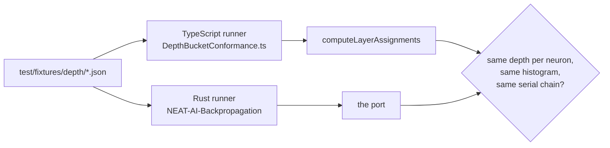

# 📏 Depth-bucketing conformance corpus

> [!NOTE]
> These bytes are a **description of current behaviour**, not a design. If a
> case disagrees with `src/propagate/LayerAssignment.ts`, the case is wrong —
> the implementation is the reference. Changing the depth rule means changing
> the implementation and the corpus together, in a change that says so.

## 📌 What this is

A language-neutral corpus that freezes what `computeLayerAssignments` calls a
neuron's **depth** (Issue #3972).

A per-depth gradient profile — the measurement
[`src/propagate/GradientDepthProbe.ts`](../../../src/propagate/GradientDepthProbe.ts)
produces, and the one
[NEAT-AI-Backpropagation](https://github.com/stSoftwareAU/NEAT-AI-Backpropagation)
produces over its own epoch loop — is only comparable across engines if the
engines bucket the same neuron at the same depth. That agreement has to be
verified on a shared fixture _before_ any GRQ number is trusted, so it is frozen
here rather than left to a reading of the TypeScript.



The TypeScript half of the contract is
[`test/propagate/DepthBucketConformance.ts`](../../propagate/DepthBucketConformance.ts),
which runs in the normal `deno test` gate.

## 🧬 `topology.json` — the rules, one case each

```json
{
  "group": "topology",
  "cases": [
    {
      "name": "linear-chain",
      "notes": "free text — JSON has no comments",
      "creature": { "input": 1, "output": 1, "neurons": [], "synapses": [] },
      "expect": {
        "depth": { "input-0": 0, "h1": 1, "output-0": 2 },
        "maxDepth": 2
      }
    }
  ]
}
```

- `expect.depth` is keyed by neuron `uuid`, except input neurons, which are
  keyed `input-<index>` because they carry no uuid.
- `expect.maxDepth` is the highest occupied layer, which output neurons are
  always forced into.

The rules each case pins down:

| Case                              | Rule                                                                                |
| --------------------------------- | ----------------------------------------------------------------------------------- |
| `linear-chain`                    | Depth is the hop count from an input.                                               |
| `longest-path-wins`               | A neuron reachable by two paths takes the **longer**.                               |
| `outputs-share-the-final-layer`   | Outputs sit one layer past the deepest hidden neuron, however short their own path. |
| `constant-neurons-are-depth-zero` | A constant seeds depth 0 exactly like an input.                                     |
| `self-loop-is-ignored`            | A self-connection is not a forward edge.                                            |
| `back-edge-is-ignored`            | A cycle is broken by taking the deepest already-resolved parent.                    |

## 🧬 `grq-tail.json` — the production creature

The GRQ-lineage creature is too large to inline, so this case references
[`test/data/grq-23-forests-constants.json`](../../data/grq-23-forests-constants.json)
by path and freezes what the depth pass makes of it: `maxDepth`, the neuron and
synapse counts, the full depth histogram, and the **serial chain** — the run of
consecutive depth levels holding exactly one neuron each, which
[`src/propagate/SerialChains.ts`](../../../src/propagate/SerialChains.ts) finds
and Issue #3972 identifies as the structure that makes a zero derivative
unrecoverable. Each chain member is recorded with its uuid, depth, squash,
fan-in and fan-out.

An engine that reproduces every field here buckets depth the same way NEAT-AI
does, and its gradient profile can be compared against NEAT-AI's.
