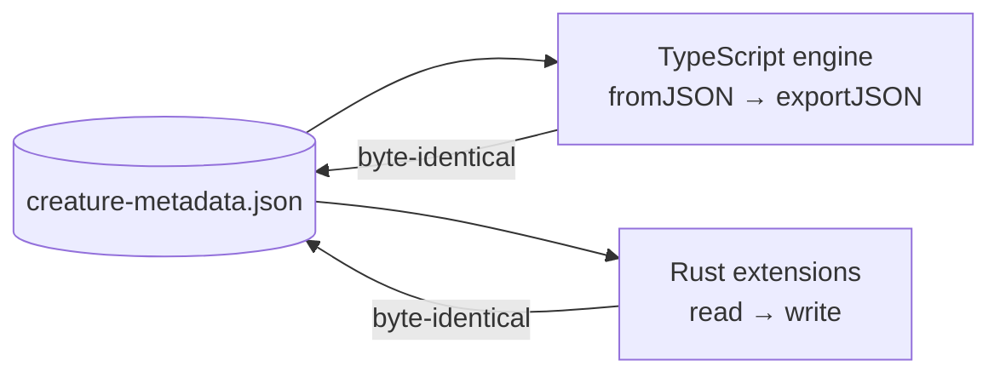

# 🥇 Golden creature-metadata fixture — the cross-engine round-trip contract

> [!CAUTION]
> **Changing `creature-metadata.json` means changing every engine that reads
> creatures.** A diff touching this directory is a cross-repo breaking change
> requiring coordinated updates in
> [NEAT-AI-core](https://github.com/stSoftwareAU/NEAT-AI-core),
> [NEAT-AI-Backpropagation](https://github.com/stSoftwareAU/NEAT-AI-Backpropagation),
> and [NEAT-AI-Lamarck](https://github.com/stSoftwareAU/NEAT-AI-Lamarck) — not a
> routine test-data edit.

## 📌 What this is

`creature-metadata.json` is the single set of bytes that every implementation of
the creature JSON format must round-trip losslessly. It exists because Issue
#3746 found the Rust extensions had silently drifted from the TypeScript
contract — `NeuronExport` gained `tags`, `SynapseExport` gained `tags`,
`CreatureCommon` gained `memetic`, and the Rust structs simply never followed.
Fixing the structs once does not stop the next divergence; a shared, versioned
fixture does.

The TypeScript engine is the **reference implementation**: it already
round-trips losslessly (`src/neuron/NeuronSerialization.ts`,
`src/creature/CreatureSerialization.ts`), so the contract lives next to the
definition rather than next to one of its consumers.

## 📍 Stable path

```text
test/fixtures/golden/creature-metadata.json
```

Consume these bytes directly (vendor a copy, or fetch the file from the
`Develop` branch). Do **not** hand-roll a near-copy in a downstream repo — a
near-copy diverges the moment this file grows a field.

## 🧬 The five metadata surfaces

Every surface below must survive a read/write cycle unchanged:

| Surface         | Where it lives in the fixture                            | Interface                              |
| --------------- | -------------------------------------------------------- | -------------------------------------- |
| Creature `uuid` | top-level `uuid`                                         | `CreatureInternal.uuid`                |
| Creature `tags` | top-level `tags`                                         | `CreatureCommon extends TagsInterface` |
| `memetic`       | top-level `memetic` (both `biases` **and** `weights`)    | `CreatureCommon.memetic`               |
| Neuron `tags`   | hidden neuron `11111111-…`, `intelligentDesign` pedigree | `NeuronAbstract extends TagsInterface` |
| Synapse `tags`  | the `11111111-…` → `22222222-…` synapse                  | `SynapseCommon.tags`                   |

The `intelligentDesign` neuron tag is the exact pedigree stamp written by
`src/intelligentDesign/ImproveSquash.ts` — the tag whose loss opened Issue
#3746.

## ✅ The reference behaviour

`test/creature/GoldenMetadataRoundTrip.ts` is the TypeScript gate. It runs with
the full suite on every PR, and asserts two independent things:

1. **Coverage** — the fixture still carries all five surfaces. Without this, a
   lossy regeneration of the fixture would leave the round-trip green while the
   contract quietly shrank.
2. **Byte-identical round trip** — `Creature.fromJSON(...)` followed by
   `exportJSON()` reproduces the file verbatim.



### 🔑 One deliberate asymmetry: the creature `uuid`

`exportJSON()` emits the UUID-only wire format (Issue #2054) and **omits** the
top-level creature `uuid` — consumers recompute it with
`CreatureUtil.makeUUID()`. The fixture stores the uuid as its leading key, and
the test restores it from the loaded creature before comparing bytes. The stored
value is the deterministic structural uuid for this topology, which the test
also verifies.

Downstream engines that rewrite a creature file in place are expected to **carry
the `uuid` through**, as `NEAT-AI-Backpropagation` and `NEAT-AI-Lamarck` do —
that is what makes the whole file, uuid included, the contract.

## ➕ Adding a field to the creature interfaces

Extending `CreatureInterfaces.ts`, `NeuronInterfaces.ts`, or
`SynapseInterfaces.ts` with a new persisted field means extending this fixture
in the same change, and coordinating the downstream repos above.

> [!NOTE]
> **Known gap (Issue #3752).** A new field added to the interfaces _without_
> extending the fixture is not caught automatically — round-tripping a fixture
> that lacks the field still passes. Detection today is review of the interface
> diff. A cheap lint/CI check comparing interface fields against fixture keys is
> the fix if this proves to be a recurring blind spot.
