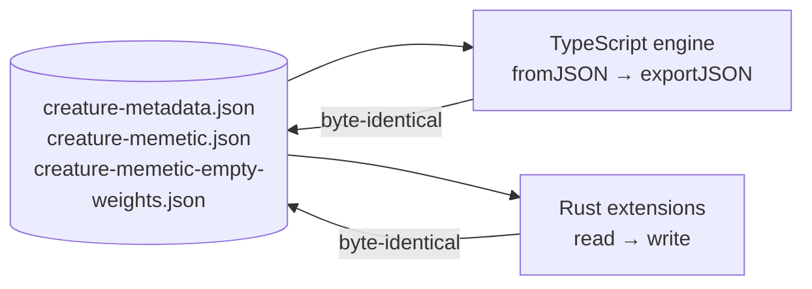

# 🥇 Golden creature fixtures — the cross-engine round-trip contract

> [!CAUTION]
> **Changing a fixture in this directory means changing every engine that reads
> creatures.** A diff touching this directory is a cross-repo breaking change
> requiring coordinated updates in
> [NEAT-AI-core](https://github.com/stSoftwareAU/NEAT-AI-core),
> [NEAT-AI-Backpropagation](https://github.com/stSoftwareAU/NEAT-AI-Backpropagation),
> and [NEAT-AI-Lamarck](https://github.com/stSoftwareAU/NEAT-AI-Lamarck) — not a
> routine test-data edit.

## 📌 What this is

These files are the bytes that every implementation of the creature JSON format
must round-trip losslessly. `creature-metadata.json` exists because Issue #3746
found the Rust extensions had silently drifted from the TypeScript contract —
`NeuronExport` gained `tags`, `SynapseExport` gained `tags`, `CreatureCommon`
gained `memetic`, and the Rust structs simply never followed. Fixing the structs
once does not stop the next divergence; a shared, versioned fixture does.

The TypeScript engine is the **reference implementation**: it already
round-trips losslessly (`src/neuron/NeuronSerialization.ts`,
`src/creature/CreatureSerialization.ts`), so the contract lives next to the
definition rather than next to one of its consumers.

## 📍 Stable paths

| Fixture                               | Pins                                                                    | Issue |
| ------------------------------------- | ----------------------------------------------------------------------- | ----- |
| `creature-metadata.json`              | the five metadata surfaces below                                        | #3752 |
| `creature-memetic.json`               | a populated `memetic` block, `ancestry[]` included                      | #3814 |
| `creature-memetic-empty-weights.json` | the same creature with the empty `"weights": []` shape production emits | #3814 |

Consume these bytes directly (vendor a copy, or fetch the files from the
`Develop` branch). Do **not** hand-roll a near-copy in a downstream repo — a
near-copy diverges the moment a file grows a field.

The two memetic fixtures deliberately share one topology, and therefore one
structural `uuid`: `memetic` is fine-tuning state, not creature identity, so the
only difference between the files is the block under test.

## 🧬 The five metadata surfaces

Every surface below must survive a read/write cycle unchanged:

| Surface         | Where it lives in the fixture                            | Interface                              |
| --------------- | -------------------------------------------------------- | -------------------------------------- |
| Creature `uuid` | top-level `uuid`                                         | `CreatureInternal.uuid`                |
| Creature `tags` | top-level `tags`                                         | `CreatureCommon extends TagsInterface` |
| `memetic`       | top-level `memetic` (both `biases` **and** `weights`)    | `CreatureCommon.memetic`               |
| Neuron `tags`   | hidden neuron `11111111-…`, `intelligentDesign` pedigree | `NeuronAbstract extends TagsInterface` |
| Synapse `tags`  | the `11111111-…` → `22222222-…` synapse                  | `SynapseCommon.tags`                   |

The `intelligentDesign` neuron tag is the exact pedigree stamp written by
`src/intelligentDesign/ImproveSquash.ts` — the tag whose loss opened Issue
#3746.

## 🧠 The canonical memetic wire shape (Issue #3814)

`memetic` is written by `src/creature/MemeticWireExport.ts`. Its canonical wire
shape — in the top-level snapshot **and** in every `ancestry[]` snapshot — is:

- **`weights`: a JSON array of `{ fromUUID, toUUID, weight }` rows.** Never a
  map. The array is frequently **empty** (`"weights": []`), because a creature
  that has not had a memetic pass still writes the key; the empty form is part
  of the contract, not a degenerate case.
- **`biases`: a JSON object** keyed by wire neuron identity (`input-N`,
  `output-N`, or a hidden neuron `uuid`).
- **`generation` and `score`: numbers.**

The asymmetry is deliberate and load-bearing: a bias belongs to one neuron so a
map is natural, whereas a weight belongs to an ordered `from → to` pair that a
single map key cannot express without inventing a composite string.

> [!CAUTION]
> **Every engine must be able to parse every fixture committed here.** Issue
> #3810 is what happens when one cannot: `MemeticExport::weights` in the Rust
> scorer was typed as a map, so `rust_scorer` died with
> `invalid type: sequence, expected a map` on **every** creature carrying
> `memetic` — including the `"weights": []` case — and every evolve run silently
> degraded to WASM scoring. The metadata fixture alone did not catch it, which
> is why `creature-memetic.json` and `creature-memetic-empty-weights.json` now
> pin both shapes.

Verify a fixture against the native scorer with:

```bash
rust_scorer --gpu off test/fixtures/golden/creature-memetic.json /tmp/empty-corpus
# Expected: "Error: No .bin files found in training data directory" — the parse
# succeeded and the binary reached real work. A "Creature JSON error" is a
# contract break.
```

## ✅ The reference behaviour

`test/creature/GoldenMetadataRoundTrip.ts` is the TypeScript gate. It runs with
the full suite on every PR, and asserts three independent things:

1. **Coverage** — `creature-metadata.json` still carries all five surfaces, and
   the memetic fixtures still carry a populated block, an `ancestry[]` snapshot
   with its own weights and biases, and the empty `"weights": []` variant.
   Without this, a lossy regeneration of a fixture would leave the round-trip
   green while the contract quietly shrank.
2. **Canonical wire shape** — every snapshot of every fixture, ancestry
   included, serialises `weights` as an array of `{ fromUUID, toUUID, weight }`
   rows.
3. **Byte-identical round trip** — `Creature.fromJSON(...)` followed by
   `exportJSON()` reproduces each file verbatim, and a second cycle does not
   drift.



### 🔑 One deliberate asymmetry: the creature `uuid`

`exportJSON()` emits the UUID-only wire format (Issue #2054) and **omits** the
top-level creature `uuid` — consumers recompute it with
`CreatureUtil.makeUUID()`. Each fixture stores the uuid as its leading key, and
the test restores it from the loaded creature before comparing bytes. The stored
value is the deterministic structural uuid for that topology, which the test
also verifies.

Downstream engines that rewrite a creature file in place are expected to **carry
the `uuid` through**, as `NEAT-AI-Backpropagation` and `NEAT-AI-Lamarck` do —
that is what makes the whole file, uuid included, the contract.

## ➕ Adding a field to the creature interfaces

Extending `CreatureInterfaces.ts`, `NeuronInterfaces.ts`, or
`SynapseInterfaces.ts` with a new persisted field means extending these fixtures
in the same change, and coordinating the downstream repos above.

> [!NOTE]
> **Known gap (Issue #3752).** A new field added to the interfaces _without_
> extending the fixture is not caught automatically — round-tripping a fixture
> that lacks the field still passes. Detection today is review of the interface
> diff. A cheap lint/CI check comparing interface fields against fixture keys is
> the fix if this proves to be a recurring blind spot.
