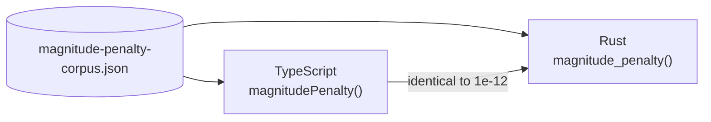

# ⚖️ Magnitude penalty corpus — the cross-engine scoring contract

> [!CAUTION]
> **Changing `magnitude-penalty-corpus.json` changes every score in the fleet.**
> The TypeScript engine (`src/architecture/Score.ts`) and the Rust engine
> (`rust_scorer/src/scoring.rs` in
> [NEAT-AI-scorer](https://github.com/stSoftwareAU/NEAT-AI-scorer)) must return
> the same number for every case here, or `NEAT_AI_RUST_SCORER_STRICT` fires on
> a creature that scored differently depending on which engine ran it.

## 📌 What this is

Issue #3881: the old `1 / (1 + 1 / value)` curve was 0.990 at `|w| = 100` and
0.9999 at `|w| = 1000`, so past about two decades it could no longer tell a
sensible weight from an absurd one. Nothing in the score objected to drift, and
production weights reached `1.156e+195`.

The replacement charges a **constant amount per decade**. This corpus is the
language-neutral statement of that curve across magnitudes `1 → 1e20`, so a port
can be checked without reading either implementation.

| Field               | Meaning                                                    |
| ------------------- | ---------------------------------------------------------- |
| `cases[].magnitude` | the absolute value of a single weight or bias              |
| `cases[].penalty`   | what every engine must return for that magnitude           |
| `decadeCap`         | decades above 1.0 that span the useful range (12)          |
| `maxSafeMagnitude`  | magnitudes are clamped to this before the curve is applied |
| `tolerance`         | absolute agreement required between engines (1e-12)        |

The last four cases (`9007199254740991`, `1e16`, `1e18`, `1e20`) deliberately
share one penalty: a magnitude beyond `maxSafeMagnitude` is clamped to it, which
is what stops a `1e+195` weight throwing instead of being charged for.

## ✅ The gates

| Engine     | Gate                                                            |
| ---------- | --------------------------------------------------------------- |
| TypeScript | `test/score/MagnitudeSelectionPressure.ts`                      |
| Rust       | `rust_scorer/tests/magnitude_penalty_corpus.rs` (vendored copy) |

Both read the same bytes. Vendor a copy into a downstream repo rather than
hand-rolling a near-copy — a near-copy diverges the moment a case is added.

## 🎯 `fitness-corpus.json` — the full-fidelity scoring golden

Issue #3926 added a cheaper _fitness corpus_ (a NEAT-AI-Refinery sample of the
full one). Nothing in that work may move the full-fidelity path, and this
fixture is how that is asserted rather than eyeballed.

| Field                | Meaning                                                   |
| -------------------- | --------------------------------------------------------- |
| `cost`               | the cost function the goldens were computed under (`MSE`) |
| `creature`           | a forward-only creature export — the thing being scored   |
| `records`            | the whole corpus, as explicit input/output values         |
| `sampleIndices`      | the records a 0.25 sample of that corpus holds            |
| `fullCorpusError`    | what scoring **every** record must return                 |
| `sampledCorpusError` | what scoring only `sampleIndices` must return             |

Every value is a multiple of 1/256, so the records survive a JSON round-trip
into `float32` exactly and the goldens do not depend on decimal parsing.

Gate: `test/score/FullCorpusScoreFixture.ts`. It compares **IEEE-754 bit
patterns**, not an epsilon — a full-corpus score that differs in the last bit
fails. The corpus is written as a single `.bin` shard, the layout Refinery
publishes, because averaging is per shard and a different partitioning is a
different summation order.

> [!CAUTION]
> Do not regenerate the goldens to make a failing run pass. A changed
> `fullCorpusError` means every score in the fleet moved; find out why first.
