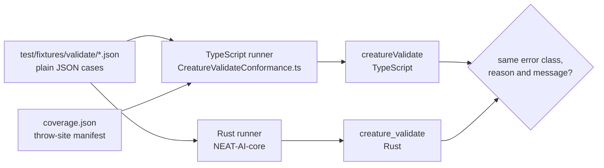

# 🧾 `creatureValidate` conformance corpus

> [!NOTE]
> These bytes are a **description of current behaviour**, not a design. If a
> case disagrees with `src/architecture/CreatureValidate.ts`, the case is wrong
> — the implementation is the reference. Changing a rule means changing the
> implementation and the corpus together, in a change that says so.

## 📌 What this is

A language-neutral corpus that freezes what `creatureValidate` does today (Issue
#3801), so validation can move into
[NEAT-AI-core](https://github.com/stSoftwareAU/NEAT-AI-core) (Issue #3800)
against an executable definition rather than a reading of the TypeScript.

Every file here is plain JSON — no `$ref`, no comments, no TypeScript
constructs, no code-built creatures — so NEAT-AI-core can vendor the same bytes
verbatim as a Rust test input. The TypeScript side of the contract is
`test/validate/CreatureValidateConformance.ts`, which loads each file with
`JSON.parse` and replays every case against the current implementation. It runs
in the normal `deno test` gate, so behavioural drift fails CI on the offending
case name.



## 🧬 Case format

```json
{
  "group": "per-type-rules",
  "cases": [
    {
      "name": "hidden-without-inward-connection",
      "rule": "HIDDEN_NO_INWARD",
      "notes": "free text — JSON has no comments",
      "creature": { "input": 1, "output": 1, "neurons": [], "synapses": [] },
      "options": { "forwardOnly": false },
      "expect": {
        "outcome": "throws",
        "error": "ValidationError",
        "reason": "NO_INWARD_CONNECTIONS",
        "messageContains": "has no inward connections"
      }
    }
  ]
}
```

- `rule` names a site in `coverage.json`.
- `options` is the second argument to `creatureValidate` (`neurons`,
  `connections`, `feedbackLoop`, `forwardOnly`); omit it for no options.
- `expect.outcome` is `"throws"` (with `error`, `reason` and `messageContains`)
  or `"ok"` (with the exact `stats` object: `input`, `constant`, `hidden`,
  `output`, `connections`).

### Why the creature is in the runtime shape, not the `exportJSON()` shape

The creature is described in the **runtime** (`CreatureInternal`) shape —
neurons carry `type`, `id`, `index`, `bias`, `squash`, `uuid`, and synapses
carry integer `from`/`to` — rather than the UUID-only wire shape.

That is deliberate. Most of what `creatureValidate` rejects is exactly what the
loader normalises or refuses: `loadFrom` canonicalises neuron order, resolves
UUIDs to fresh integer ids, and repairs invalid `IF` neurons. A wire-shaped
fixture therefore cannot express a duplicate id, a constant sitting after a
hidden, an input neuron whose id is not its index, or a non-finite bias — and
those are throw sites the corpus exists to pin. The runtime shape is also what a
Rust `creature_validate` will receive after its own load step, so it is the
honest boundary to freeze.

Two JSON conventions carry values JSON has no literal for:

| Fixture value                          | In memory                      |
| -------------------------------------- | ------------------------------ |
| `null` (or an absent key)              | `undefined`                    |
| `"Infinity"` / `"-Infinity"` / `"NaN"` | the matching non-finite number |

An input neuron with no `bias` key gets `Infinity`, matching what the `Neuron`
constructor does at runtime.

## 🗺️ Case → rule map

`coverage.json` is the manifest: it lists every validation site in
`CreatureValidate.ts`, in source order, with the error class and reason it
raises. The runner asserts that every site is accounted for, so deleting a case
fails the gate instead of silently shrinking coverage.

| File                      | Cases                                                                                                                                                                                                                                                                                                                                                                          | Sites pinned                                                                                                                                                                                                                               |
| ------------------------- | ------------------------------------------------------------------------------------------------------------------------------------------------------------------------------------------------------------------------------------------------------------------------------------------------------------------------------------------------------------------------------ | ------------------------------------------------------------------------------------------------------------------------------------------------------------------------------------------------------------------------------------------ |
| `options-and-counts.json` | `options-neurons-mismatch`, `options-connections-mismatch`, `input-count-zero`, `input-count-not-integer`, `output-count-zero`, `output-count-not-integer`, `stats-input-count-mismatch`, `stats-output-count-mismatch`                                                                                                                                                        | `OPTIONS_NEURONS_MISMATCH`, `OPTIONS_CONNECTIONS_MISMATCH`, `INPUT_COUNT_INVALID`, `OUTPUT_COUNT_INVALID`, `STATS_INPUT_MISMATCH`, `STATS_OUTPUT_MISMATCH`                                                                                 |
| `neuron-identity.json`    | `neuron-missing-id`, `neuron-id-not-integer`, `neuron-id-above-int32-max`, `neuron-id-duplicate`, `input-neuron-id-not-index`, `output-bias-not-finite`, `hidden-bias-undefined-shadowed`, `hidden-bias-nan-shadowed`, `neuron-index-mismatch`                                                                                                                                 | `NEURON_NO_ID`, `NEURON_ID_INVALID`, `NEURON_ID_DUPLICATE`, `INPUT_NEURON_ID_MISMATCH`, `NEURON_BIAS_NOT_FINITE`, `HIDDEN_BIAS_UNDEFINED`, `HIDDEN_BIAS_NOT_FINITE`, `NEURON_INDEX_MISMATCH`                                               |
| `neuron-ordering.json`    | `type-after-output-neuron`, `input-neuron-past-input-count`, `constant-after-hidden`                                                                                                                                                                                                                                                                                           | `TYPE_AFTER_OUTPUT`, `INPUT_NEURON_PAST_INPUT_COUNT`, `NEURON_ORDER_CONSTANT_AFTER_HIDDEN`                                                                                                                                                 |
| `if-squash.json`          | `if-too-few-inward`, `if-missing-condition`, `if-missing-positive`, `if-missing-negative`, `if-with-all-three-synapse-types`                                                                                                                                                                                                                                                   | `IF_TOO_FEW_INWARD`, `IF_MISSING_CONDITION`, `IF_MISSING_POSITIVE`, `IF_MISSING_NEGATIVE`, `OK_IF`                                                                                                                                         |
| `per-type-rules.json`     | `input-neuron-with-inward-connection`, `constant-with-inward-connection`, `constant-with-squash`, `constant-without-outward-connection`, `hidden-without-inward-connection`, `hidden-without-outward-connection`, `unknown-neuron-type`                                                                                                                                        | `INPUT_HAS_INWARD`, `CONSTANT_HAS_INWARD`, `CONSTANT_HAS_SQUASH`, `CONSTANT_NO_OUTWARD`, `HIDDEN_NO_INWARD`, `HIDDEN_NO_OUTWARD`, `INVALID_NEURON_TYPE`                                                                                    |
| `synapses.json`           | `synapse-points-at-input-shadowed`, `forward-only-self-connection`, `synapses-not-sorted-by-from`, `synapses-not-sorted-by-to`, `synapses-not-sorted-by-type`, `duplicate-synapse`, `duplicate-synapse-roles-into-non-if`, `if-shared-source-feeds-both-branches`, `recursive-synapse-rejected-when-feedback-loop-false`, `recursive-synapse-accepted-when-feedback-loop-true` | `SYNAPSE_TO_INPUT`, `SELF_CONNECTION_FORWARD_ONLY`, `SORT_FAILURE_FROM`, `SORT_FAILURE_TO`, `SORT_FAILURE_TYPE`, `DUPLICATE_SYNAPSE`, `DUPLICATE_SYNAPSE_NON_IF`, `OK_IF_SHARED_SOURCE`, `RECURSIVE_SYNAPSE`, `OK_RECURRENT_FEEDBACK_TRUE` |
| `forward-only.json`       | `forward-only-backward-synapse-shadowed`, `forward-only-structural-defect-shadowed`, `forward-only-cycle-shadowed`                                                                                                                                                                                                                                                             | `WASM_FORWARD_ONLY`, `WASM_STRUCTURAL`, `WASM_CYCLE`                                                                                                                                                                                       |
| `memetic.json`            | `memetic-valid`, `memetic-bias-unknown-neuron`, `memetic-weight-unknown-source-neuron`, `memetic-weights-not-an-array`, `memetic-weight-missing-to-id`, `memetic-weight-missing-weight`, `memetic-weight-to-id-has-no-neuron`, `memetic-weight-without-matching-synapse`                                                                                                       | `OK_MEMETIC`, `MEMETIC_BIAS_UNKNOWN_NEURON`, `MEMETIC_WEIGHT_UNKNOWN_NEURON`, `MEMETIC_WEIGHTS_NOT_ARRAY`, `MEMETIC_WEIGHT_MISSING_TO_ID`, `MEMETIC_WEIGHT_MISSING_WEIGHT`, `MEMETIC_WEIGHT_TO_ID_UNKNOWN`, `MEMETIC_WEIGHT_NO_SYNAPSE`    |
| `happy-paths.json`        | `ok-minimal`, `ok-with-constant`, `ok-with-hidden-layer`, `ok-recurrent-default-options`, `ok-forward-only`                                                                                                                                                                                                                                                                    | `OK_MINIMAL`, `OK_CONSTANTS`, `OK_HIDDEN`, `OK_RECURRENT_DEFAULT`, `OK_FORWARD_ONLY`                                                                                                                                                       |

## 🕳️ Sites that cannot be reached, and one that cannot be written

Writing the corpus surfaced six throw sites no input can reach and one no
fixture can describe. They are recorded here rather than fixed: this issue is
description only, and a Rust port needs to know which branches are dead before
it copies them.

| Site                                                 | Why                                                                                                                                    | What actually happens                                            |
| ---------------------------------------------------- | -------------------------------------------------------------------------------------------------------------------------------------- | ---------------------------------------------------------------- |
| `HIDDEN_BIAS_UNDEFINED`, `HIDDEN_BIAS_NOT_FINITE`    | The generic non-input bias check runs first, and `Number.isFinite` is false for `undefined` and `NaN` alike                            | `ValidationError` / `OTHER`, `invalid bias: …`                   |
| `SYNAPSE_TO_INPUT`                                   | A synapse targeting an input neuron makes that neuron fail `INPUT_HAS_INWARD` in the earlier neuron loop                               | `TopologyError` / `INVALID_CONNECTION`, `has inward connections` |
| `WASM_FORWARD_ONLY`, `WASM_STRUCTURAL`, `WASM_CYCLE` | The `forwardOnly` leg runs last, and the TypeScript loops already reject every defect those checks look for                            | the corresponding TypeScript error                               |
| `NEURON_CREATURE_MISMATCH`                           | `neuron.creature !== creature` is a TypeScript object-identity comparison with no language-neutral equivalent — no JSON can express it | covered by the hand-written tests instead                        |

`NEURON_CREATURE_MISMATCH`, `NEURON_INDEX_MISMATCH` and the `neuron.validate()`
calls are the **host-only** half of `creatureValidate` (Issue #3802): they read
JavaScript object identity and in-memory caches, so they stay in TypeScript
whatever else moves to Rust. They are isolated in `hostOnlyNeuronChecks` in
`src/architecture/CreatureValidate.ts`, and the order in which they interleave
with the rule checks — which a Rust port has to reproduce — is pinned by
`test/validate/CreatureValidateHostOnlyOrdering.ts`.

### The synapse key is `(from, to, type)` (Issue #3873)

Uniqueness is the **triple**, and the canonical sort order is the same triple so
it stays total. An `IF` neuron sums its inward synapses **per role**, so one
source may feed it once per role — `if-shared-source-feeds-both-branches` is
that shape, and it replaces the IDENTITY relay neuron the `(from, to)` key used
to force. Every other squash sums regardless of role, so a repeated pair there
is still a duplicate: `duplicate-synapse-roles-into-non-if`. A repeated pair
whose roles descend is out of order: `synapses-not-sorted-by-type`.

The `duplicate-synapse` case carries a second discrepancy in its `notes`:
duplicate `(from, to)` raises `TopologyError` / `INVALID_CONNECTION` even though
`ValidationErrorName` already declares a `DUPLICATE_SYNAPSE` reason. That
interacts with stSoftwareAU/NEAT-AI-core#556 and is recorded, not resolved.

## ➕ Adding a case

1. Add the case to the matching group file (or a new file — the runner reads
   every `*.json` here except `coverage.json`).
2. Give it a unique `name` and a `rule` declared in `coverage.json`.
3. Run `deno test test/validate/CreatureValidateConformance.ts`. A case that
   disagrees with the current implementation fails at authoring time; fix the
   case, not `CreatureValidate.ts`.

The hand-written suites in `test/validate/` and `test/architecture/` stay as
they are. This corpus adds coverage; it does not replace them.
